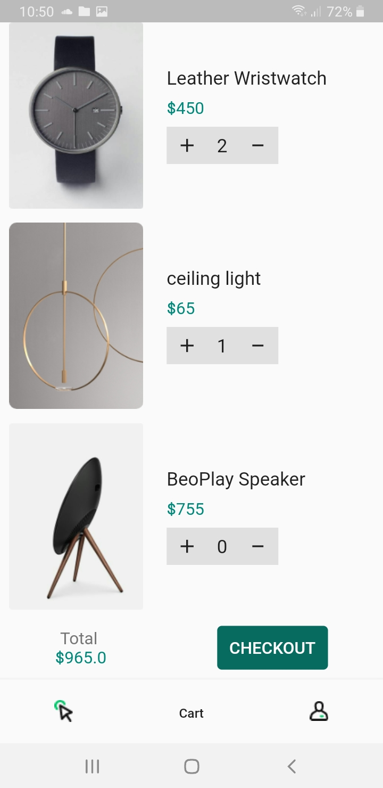
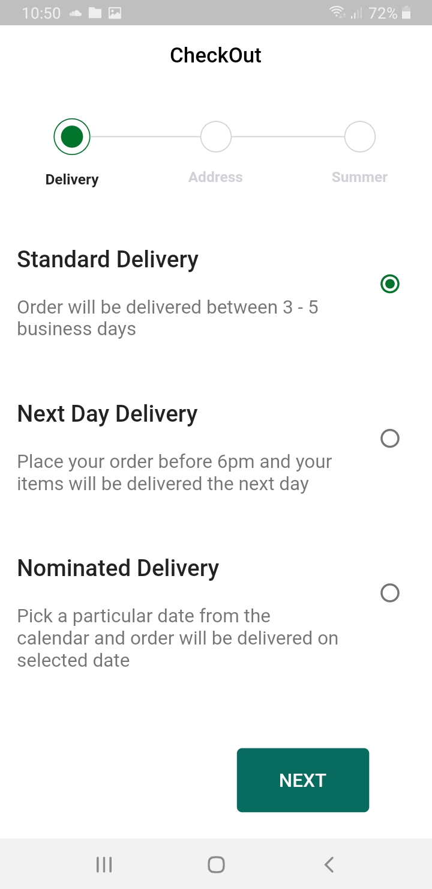

# E-Commerce App - Flutter Firebase Using Get-x

#
#

| sign in     | Register |
| -------------- | -------------- |
| 
  
 | 
  
 |

#
#

| Home   | cart     | account |
| -------------- | -------------- | -------------- |
| 
  
 | 
  
 |
  
 |

#
#

| detail   | checkout 1     | checkout 2 |
| -------------- | -------------- | -------------- |
| 
  
 | 
  
 |
  
 |
